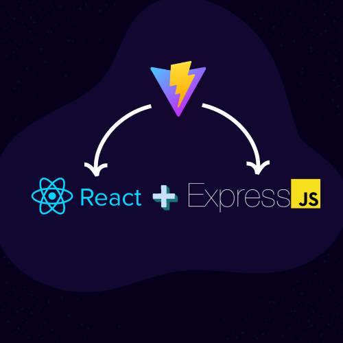

# WordHive - Online Dictionary and Word Relations Explorer


<p align="center" width="100%">
     
</p>

WordHive is an online dictionary and word relations explorer built using React.js, Vite, and Express. This web application provides users with comprehensive information about searched words, including synonyms, antonyms, definitions, example statements, pronunciation, and syllable breakdowns. Additionally, WordHive allows users to explore the intricate relationships between words and phrases, uncovering hierarchical connections and compositional relationships.

The seamless integration of React, Vite, and Express ensures that WordHive operates with unrivaled speed and efficiency. Powered by a robust backend, the application's API calls swiftly fetch and present the desired word information, while the frontend's responsive design and interactive elements enhance the user experience.

The Frontend is hosted at [wordhive.app](https://wordhive.app), and Backend is hosted at [wordhive.dev](https://wordhive.dev)

## Features

- Comprehensive Word Information

    WordHive offers detailed information about searched words, giving users a complete understanding of each word's meaning and usage. Whether you need synonyms, antonyms, definitions, example statements, pronunciation, or syllable breakdowns, WordHive has you covered.

- Word Relations Explorer

    Uncover the hidden connections between words and phrases using WordHive's powerful word relations explorer. Discover hierarchical relationships such as "is a type of," "has types," and compositional relationships like "part of" and "is an instance of." Dive into similarity associations, entailments, categories, usage contexts, regional relevance, and more.

- User-Friendly Interface

    WordHive boasts an intuitive and visually appealing user interface, ensuring a seamless and enjoyable experience for language enthusiasts of all levels. The interface makes word searches and information access effortless and engaging.

- Word Pronunciation

    Enhance your language learning and spoken language skills with WordHive's accurate word pronunciation feature. Users can listen to the correct pronunciation of each word.

- React-Powered Frontend

    The frontend of WordHive harnesses the power of React.js, providing a dynamic and interactive user experience. React's component-based architecture ensures a smooth and responsive interface.
    
- Frequency Scoring

    Discover the popularity and usage of words in English with Zipf scores, perMillion frequency, and diversity scores. Gain valuable insights into word commonness, prevalence, and usage diversity, enhancing your understanding of the English language landscape.


## Project Integration


<p align="center" width="100%">
     
</p>

In this project following [this](https://github.com/NathanKr/react-vite-express-setup) guide, I skillfully integrated React, Vite, and Express to create a seamless and efficient web application. Leveraging Express, I established backend API calls, allowing smooth communication between the frontend and the word API. React played a pivotal role in crafting the dynamic and interactive user interface, rendering components efficiently with its virtual DOM. Vite served as the build tool and development server, expediting the development cycle and providing instantaneous feedback during the iterative process.

## API Referencing

WordHive harnesses the power of two essential APIs to provide accurate word pronunciations and comprehensive word information:

- Word Pronunciation - [Elevenlabs Text-to-Speech API](https://github.com/FelixWaweru/elevenlabs-node)

    WordHive leverages the Elevenlabs Text-to-Speech API to offer precise word pronunciations. The API seamlessly integrates into WordHive, allowing users to listen to the correct pronunciation of each word. This immersive feature enhances language learning and improves spoken language skills, ensuring users can confidently pronounce words accurately.

- Word Dictionary - [WordsAPI](https://rapidapi.com/dpventures/api/wordsapi/)

    For comprehensive word information, WordHive relies on the WordsAPI to fetch detailed data about searched words. This robust dictionary API supplies synonyms, antonyms, definitions, example statements, pronunciation, and syllable breakdowns, enriching the user's understanding of each word's meaning and usage.

    These APIs form the backbone of WordHive, enabling seamless access to valuable language resources and empowering users to explore the vast landscape of words and their relationships.

## Requirements

[NodeJs](https://nodejs.org/en)

## Get Started

- Download or Clone the Repository:

    Download the WordHive repository to your local machine or clone it using Git by running the following command in your terminal:
    ```
    git clone https://github.com/kandalgaonkarshubham/WordHive.git

    ```
- Install Dependencies:

    Navigate into the WordHive directory and install the necessary dependencies using npm:
    ```
    cd WordHive
    npm run initiate
    ```

- Start the Application:

    ```
    npm run start
    ```
## API Exhaustion Prevention

I have developed an activation page that verifies the presence of an API key in the Express backend. If the API key is not set, the page redirects to the activation page. On this page, users can input a code to activate the API key in the backend for a specific time interval they select. 

The reason behind implementing this functionality is to prevent excessive usage of the API key due to hosting on Netlify. It is essential to note that this feature solely serves the purpose of hosting and can be safely removed from the codebase without affecting any other functionalities.

## Acknowledgements and Open Source Contributions

WordHive is a testament to the collaborative and supportive nature of the open-source community. Throughout the development process, I have utilized various open-source elements and pages sourced from platforms like [UIverse](https://uiverse.io) and [CodePen](https://codepen.io/). These invaluable contributions played a significant role in shaping the visual appeal and functionality of WordHive.

I would like to express my sincere gratitude to the creators and contributors of these open-source resources. Their dedication to sharing knowledge and expertise has enriched the project and enhanced the user experience.

To ensure proper attribution and compliance with open-source licenses, I have diligently referenced each element and page within the codebase. As a firm believer in the importance of giving credit where it's due, I am committed to upholding the principles of open-source software development.

WordHive is a project born out of a genuine passion for learning and web development. My primary goal with WordHive was to enhance my skills in React and Express. WordHive is a free and open project, not intended for commercial use or monetization. It's a labor of love, dedicated to fostering a deeper appreciation for the richness of language and serving as a platform for continuous learning and exploration in the realm of Web Development.